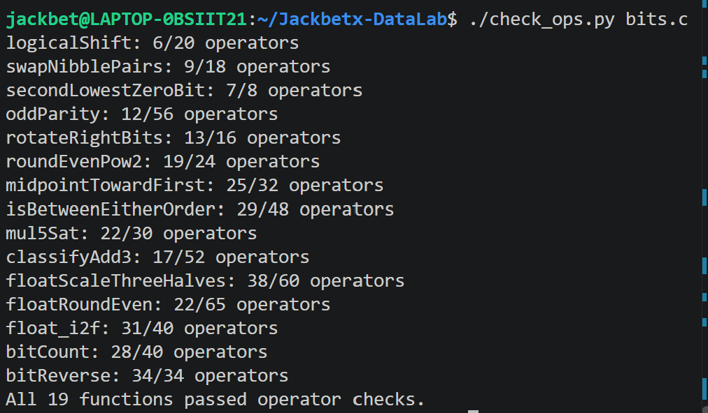
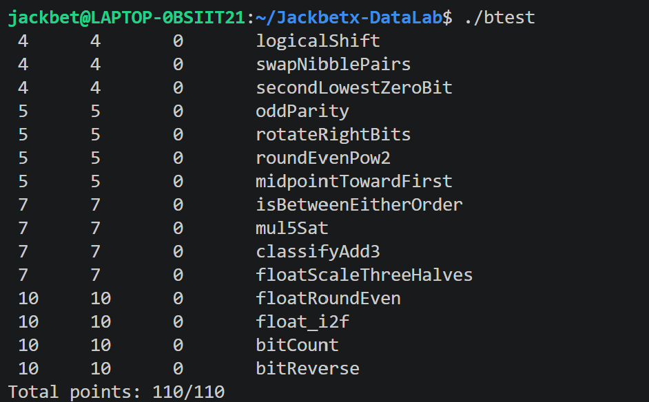

# CS:APP Data Lab 位运算实验报告

**姓名：** 张泽宇  
**学号：** 24300200009 

**实验日期：** 2026.10.8

## 一、实验目的

本实验通过实现 `bits.c` 中的 19 个函数，理解整数补码、位运算和 IEEE 754 单精度浮点数的表示方式，并学习在受限运算符条件下完成条件选择、溢出检测、舍入和数据转换。

整数题按照实验规定的 32 位补码模型处理，右移采用算术右移，超出范围的计算结果保留低 32 位。浮点题通过整数运算处理浮点编码，不直接使用浮点类型和浮点运算。

## 二、实验检查与截图

### 1. 运算符检查

在终端执行：

```bash
./check_ops.py bits.c
```

检查各函数使用的运算符及运算次数是否符合题目要求。


### 2. 正确性测试

编译后，在终端执行：

```bash
./btest
```

检查各函数的输出是否符合预期。


运行后的最终结果显示：19 个函数全部通过运算符检查和正确性测试，总分为 **110/110**。

## 三、各函数的实现思路

### 1. signMask：构造符号位掩码

题目要求返回只有最高位为 1、其余位为 0 的整数。

将常量 `1` 左移 31 位，即可得到 `0x80000000`。表达式中直接使用的常量均在 0～255 范围内，符合整数题的限制。

### 2. bitXor：使用取反和按位与实现异或

异或的特点是对应位不同则为 1，相同则为 0。

可以把“对应位不同”分解为两个条件：不是同时为 1，也不是同时为 0。两个条件分别表示为：

```c
~(x & y)
~(~x & ~y)
```

将二者按位与，得到：

```c
~(x & y) & ~(~x & ~y)
```

该表达式只使用 `~` 和 `&`，能够实现按位异或。

### 3. negativePart：提取负数部分的相反数

将 `x` 算术右移 31 位，可得到符号掩码：负数对应全 1，非负数对应全 0。

用该掩码与 `x` 按位与，负数被保留，非负数变为 0。随后对结果取反加 1，得到所需的相反数；0 经过该操作仍然为 0。

对于 `INT_MIN`，按照实验的 32 位运算模型，其取负结果仍为 `INT_MIN`。

### 4. copyByteWithin：复制指定字节

先将源字节右移到最低字节位置，再与 `255` 按位与，提取源字节。随后将它左移到目标字节位置。

通过对 `255 << (dst << 3)` 取反，构造目标字节为 0、其余位置为 1 的掩码。用该掩码清除原数的目标字节，再与移动后的源字节按位或，即可完成复制。

字节位置乘以 8，通过左移 3 位实现。

### 5. logicalShift：实现逻辑右移

直接对 `int` 使用右移会执行算术右移，负数左侧补 1。逻辑右移要求左侧补 0，因此需要清除这些补入的位。

先构造高 `n` 位为 0、其余位为 1 的掩码，再与 `x >> n` 按位与。掩码通过以下过程构造：

```c
~(((1 << 31) >> n) << 1)
```

该构造能够处理 `n = 0` 和 `n = 31`，不会出现移位 32 位的情况。

### 6. swapNibblePairs：交换每个字节内的两个半字节

使用 `0x0F0F0F0F` 形式的掩码，同时提取四个字节的低 4 位，再左移 4 位。

对于原来的高 4 位，先将整个整数右移 4 位，再用相同掩码筛选。这样既提取了各字节的高半字节，也清除了算术右移补入的符号位。

最后将两部分按位或，完成每个字节内部高、低 4 位的交换。

### 7. secondLowestZeroBit：标记第二个最低零位

先对 `x` 取反，把寻找第二个 0 转换为寻找第二个 1。

利用：

```c
y & (y + (~0))
```

清除最低的一个 1。然后对剩余结果 `z` 使用：

```c
z & (~z + 1)
```

提取最低的一个 1。这个位置就是原数第二个最低零位的位置。

如果原数不足两个零位，清除第一个 1 后结果为 0，最终也返回 0，不需要额外判断。

### 8. oddParity：判断二进制中 1 的数量的奇偶性

不必计算 1 的具体数量，只需将全部位异或起来。

依次将当前结果与其右移 16、8、4、2、1 位的结果异或，使所有位的奇偶信息逐步合并到最低位。随后与 `1` 按位与，提取最低位。

全部位异或后，偶数个 1 对应 0，奇数个 1 对应 1。题目要求相反，因此最后使用逻辑非 `!` 翻转结果。

### 9. rotateRightBits：循环右移

循环右移可以拆成两部分：

- 原数逻辑右移 `n` 位；
- 从右端移出的位移动到左端。

首先使用 `n & 31`，将旋转位数归一化到 0～31。通过掩码将算术右移转换为逻辑右移，另一部分则通过左移得到，最后按位或合并。

左移量使用：

```c
(32 + (~n + 1)) & 31
```

避免在 `n = 0` 时移位 32 位。此时两部分合并后的结果仍为原数。

### 10. roundEvenPow2：舍入到最近的二次幂倍数

将 `x` 分成商和余数，商为 `x >> n`。是否给商加 1，取决于三个信息：

- 第 `n−1` 位是否为 1；
- 低 `n−1` 位中是否存在 1；
- 商的最低位是否为 1。

第 `n−1` 位为 0，表示余数不到一半，不进位。该位为 1 且更低位非零，表示超过一半，需要进位。该位为 1 且更低位全零，表示恰好一半，只有商为奇数时才进位。

用按位与、按位或组合这些条件，得到进位量。调整商后左移 `n` 位，恢复为 `2ⁿ` 的倍数。

### 11. midpointTowardFirst：计算向第一个参数靠近的中点

直接计算 `x + y` 可能溢出，因此使用：

```c
(x & y) + ((x ^ y) >> 1)
```

得到向下取整的数学中点。

当精确中点不是整数时，如果 `x > y`，需要在向下取整结果上加 1；否则保持不变。和是否为奇数可以通过最低位判断。

比较 `x` 和 `y` 时分别处理同号和异号情况，避免差值溢出影响判断。最后将“和为奇数”与“`x > y`”两个条件组合，决定是否加 1。

### 12. isBetweenEitherOrder：判断是否位于无序端点区间内

不必先确定两个端点的大小，而是分别计算：

```text
p：x < a
q：x < b
```

当两个判断结果不同，说明 `x` 位于两个端点之间，或者等于较小端点。再加入 `x == a` 和 `x == b` 的判断，覆盖全部端点情况。

大小比较结合符号和差值完成：异号时直接根据符号判断，同号时利用差值符号判断，从而避免溢出造成误判。

### 13. mul5Sat：带饱和处理的五倍乘法

将五倍运算拆成三次加法，分别得到两倍、四倍和五倍结果。

用异或检测相邻计算结果的符号是否变化，再将这些标志按位或。前两次加法是同号数相加；如果它们没有溢出，最后一次加法也可以根据符号变化判断溢出。

把溢出标志扩展成全 0 或全 1 的掩码，再进行两层选择：

1. 根据原数符号，选择 `INT_MAX` 或 `INT_MIN` 作为饱和值。
2. 根据是否溢出，选择饱和值或实际计算结果。

整个过程不需要条件语句。

### 14. classifyAdd3：判断三个整数的精确和是否超出范围

先计算 `x + y`，再加上 `z`，分别记录两次加法的溢出方向：

- 正向溢出记为 1；
- 负向溢出记为 −1；
- 未溢出记为 0。

对一次加法 `s = a + b`，使用：

```c
((a ^ s) & (b ^ s)) >> 31
```

生成溢出掩码，再根据加数符号确定溢出方向。

每次溢出对应一次 `2³²` 的修正，因此两次溢出的方向可以相加，也可能相互抵消。最终的方向和正好表示精确总和高于上界、低于下界或处于合法范围。

### 15. floatScaleThreeHalves：计算浮点数的 1.5 倍

将浮点编码拆成符号、指数和小数字段，分别处理特殊值、非规格化数和规格化数。

NaN 和无穷大直接返回原编码。对于非规格化数，将小数字段乘以 3 后除以 2，并根据舍弃位进行最近偶数舍入。

对于规格化数，先补上隐含的最高位 1，再将有效数乘以 3。根据结果大小右移 1 位或 2 位，并相应调整指数。

舍入时比较被丢弃部分与一半的关系，恰好一半时根据保留部分的最低位决定是否进位。还需处理舍入导致的有效数进位和指数溢出，并保留正零、负零的符号。

### 16. floatRoundEven：将浮点数舍入为整数值的浮点编码

根据指数判断需要保留或清除多少位：

- 绝对值小于 0.5，返回带原符号的零。
- 绝对值在 `[0.5, 1)`，恰好为 0.5 时返回零，否则返回带符号的 1.0。
- 数值可能带有小数部分时，利用掩码清除小数位，再根据被清除部分进行最近偶数舍入。
- 指数足够大时，有限值本身已经是整数，直接返回；NaN 和无穷大也保持不变。

舍入后的结果仍是单精度浮点编码，而不是普通整数。

### 17. float_i2f：将整数转换为单精度浮点编码

先提取符号，并将绝对值保存为 `unsigned`。对负数在无符号数上取反加 1，能够正确处理 `INT_MIN`。

通过循环右移找到最高位 1 的位置，由此确定浮点指数。若有效位数不超过 24 位，左移对齐后可精确表示；否则保留最高 24 位，并对被丢弃的低位执行最近偶数舍入。

若舍入产生新的最高位，则再次右移并增加指数。最后组合符号、指数和小数字段。

### 18. bitCount：统计所有置位位的数量

采用分组累加方法，逐步扩大统计范围：

1. 统计每 2 位中 1 的数量。
2. 合并为每 4 位的计数。
3. 合并为每个字节的计数。
4. 通过右移和加法，将各字节计数累加到低位。

使用 `0x55555555`、`0x33333333` 和 `0x0F0F0F0F` 形式的掩码，分别隔离对应分组。所有掩码均由允许的小常量构造。

最终计数范围为 0～32，用低 6 位即可表示，因此与 `63` 按位与提取结果。

### 19. bitReverse：反转 32 位的排列顺序

采用逐级交换的方法：

1. 交换高、低 16 位。
2. 交换相邻字节。
3. 交换相邻 4 位组。
4. 交换相邻 2 位组。
5. 交换相邻单个位。

每一级通过掩码提取分组，分别左移和右移，再按位或合并。右移后的掩码同时清除算术右移补入的符号位。

为减少运算次数，从 `0x0000FFFF` 开始，通过掩码与其左移结果异或，依次生成后续所需掩码。该实现共使用 34 次运算，恰好满足限制。

## 四、测试结果

最终 `./test.sh` 输出的各函数运算次数如下：

| 函数                    | 实际运算次数 | 最大允许次数 | 正确性测试 |
| --------------------- | ------:| ------:| ----- |
| signMask              | 1      | 2      | 通过    |
| bitXor                | 7      | 8      | 通过    |
| negativePart          | 4      | 6      | 通过    |
| copyByteWithin        | 10     | 12     | 通过    |
| logicalShift          | 6      | 20     | 通过    |
| swapNibblePairs       | 9      | 18     | 通过    |
| secondLowestZeroBit   | 7      | 8      | 通过    |
| oddParity             | 12     | 56     | 通过    |
| rotateRightBits       | 13     | 16     | 通过    |
| roundEvenPow2         | 19     | 24     | 通过    |
| midpointTowardFirst   | 25     | 32     | 通过    |
| isBetweenEitherOrder  | 29     | 48     | 通过    |
| mul5Sat               | 22     | 30     | 通过    |
| classifyAdd3          | 17     | 52     | 通过    |
| floatScaleThreeHalves | 38     | 60     | 通过    |
| floatRoundEven        | 22     | 65     | 通过    |
| float_i2f             | 31     | 40     | 通过    |
| bitCount              | 28     | 40     | 通过    |
| bitReverse            | 34     | 34     | 通过    |

## 五、实验总结

通过本实验，我掌握了利用掩码提取、清除、移动和交换二进制位的方法，并能够使用全 0、全 1 掩码实现不含条件语句的选择操作。

在整数运算中，我认识到不能只根据最终结果的符号判断所有溢出情况，需要结合操作数符号和中间计算过程。在浮点运算中，我进一步理解了隐含有效位、指数偏置、非规格化数以及最近偶数舍入规则。

实验调试也表明，运算符检查与正确性测试解决的是不同问题：代码满足运算符和次数限制，并不代表结果一定正确。完成实现后，需要同时检查规则符合性和边界输入下的行为。

## 六、引用与参考资料

无。
